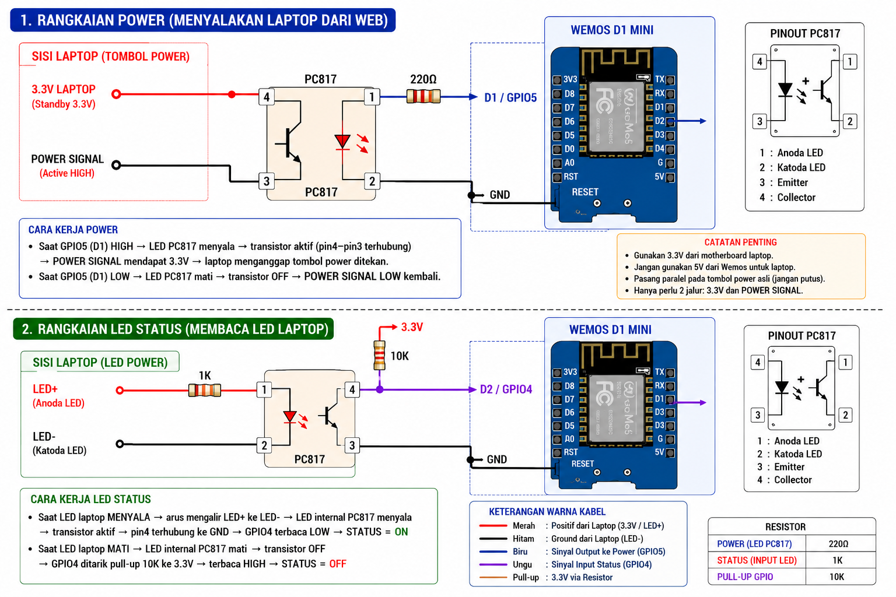
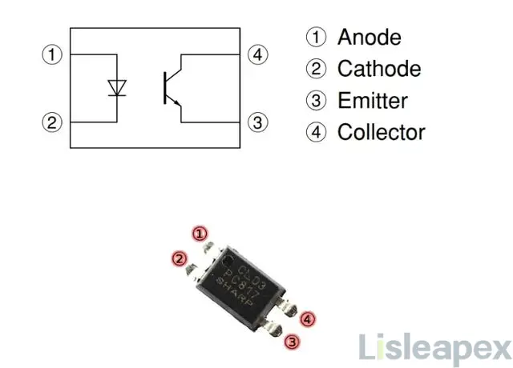

# ESP8266 Remote Power Controller (Laptop/PC)

[](https://opensource.org/licenses/MIT)

Proyek ini adalah sistem kendali jarak jauh berbasis ESP8266 yang dirancang khusus untuk **menghidupkan (Power ON)** dan **memantau status (ON/OFF)** laptop atau PC Anda melalui antarmuka web. Sistem ini menggunakan isolasi optik untuk memastikan keamanan komponen elektronik laptop/PC Anda.

## Fitur Keunggulan (Ultra Safe 24/7)

Sistem ini dirancang untuk operasional berkelanjutan dengan fitur optimasi yang membuatnya andal, ringan, dan aman:

*   **Keamanan Sistem (Optoisolation)**: Menggunakan optocoupler untuk memisahkan tegangan antara Wemos dan motherboard, mencegah *ground loop* atau kerusakan pada perangkat.
*   **Stabilitas 24/7**: 
    *   *Watchdog Timer* (`ESP.wdtFeed()`) aktif untuk mencegah *freeze* sistem.
    *   Manajemen WiFi otomatis dengan *retry logic* (interval yang meningkat secara bertahap) untuk memulihkan koneksi tanpa perlu restart manual.
*   **Manajemen Memori yang Aman**: 
    *   File log (`log.txt`) dibatasi secara ketat maksimal 10KB agar tidak merusak *flash memory* (LittleFS).
    *   Otomatis dibersihkan (*overwrite*) jika kapasitas penuh.
*   **Optimasi WebSocket**:
    *   *Heartbeat* (20 detik) untuk menjaga koneksi tetap hidup dan mendeteksi klien yang terputus.
    *   *History Logging*: Klien yang baru terhubung hanya akan menerima 15 baris log terakhir, menjaga penggunaan RAM tetap rendah.
*   **Logging Ringan**: Menggunakan *Serial logging* dan *WebSocket broadcast* secara efisien tanpa memenuhi *storage* yang tidak perlu.
*   **Responsif**: Menggunakan `yield()` secara tepat di dalam *loop* agar *network stack* ESP8266 tetap berjalan lancar tanpa *lag*.

## Keunggulan Aplikasi (Ultra Safe 24/7)

Sistem ini dirancang untuk keandalan tinggi dan penggunaan berkelanjutan:

-   **Ultra-Safe & Reliable**: Menggunakan isolasi optik untuk melindungi komponen laptop/PC dan dirancang untuk stabil beroperasi 24/7.
-   **WebSocket Real-time**: Komunikasi instan antara perangkat dan antarmuka web, memastikan pembaruan status tanpa perlu *refresh* halaman.
-   **Manajemen Memori Pintar**:
    -   **Limitasi Log**: Ukuran file `log.txt` dibatasi secara otomatis (maks ~10KB) untuk mencegah memori LittleFS penuh/korup.
    -   **History Terseleksi**: Hanya mengirimkan 15 baris log terakhir ke klien untuk menjaga performa koneksi tetap ringan.
-   **Manajemen WiFi yang Tangguh**:
    -   **Auto-Reconnect**: Fitur koneksi ulang otomatis dengan *retry interval* yang dinamis (meningkat secara bertahap hingga 45 detik) untuk efisiensi sistem.
    -   **Indikator Status**: LED bawaan memberikan informasi instan mengenai status koneksi WiFi.
- **Optimasi Sistem**: Penggunaan *Watchdog Timer* (`ESP.wdtFeed()`), manajemen *yield* untuk memastikan ESP8266 tidak *hang*, dan fitur **Daily Restart** (otomatis *restart* setiap 24 jam) untuk membersihkan memori secara berkala dan menjamin stabilitas jangka panjang.

## Perangkat Keras yang Dibutuhkan

-   **Papan ESP8266**: Contohnya NodeMCU atau Wemos D1 Mini.
-   **Modul Optocoupler**: Digunakan sebagai pengganti saklar mekanis untuk memicu tombol *power* pada laptop, PC, atau perangkat lainnya. Dihubungkan ke pin `D1` (GPIO 5).
-   **Sensor Status**: Sebuah saklar atau sensor yang memberikan sinyal LOW saat perangkat "ON". Dihubungkan ke pin `D2` (GPIO 4).

### Pinout

| Pin ESP8266 | Fungsi                 | Keterangan                               |
| :---------- | :--------------------- | :--------------------------------------- |
| `D1` (GPIO 5) | **POWER_PIN**          | Output untuk memicu optocoupler (HIGH-press, LOW-idle). |
| `D2` (GPIO 4) | **STATUS_PIN**         | Input untuk membaca status perangkat (LOW = ON). |
| `LED_BUILTIN` | **LED_PIN**            | Indikator status koneksi WiFi (LOW = Connected). |

### Detail Integrasi Hardware (Optocoupler PC817)

Diagram ini menjelaskan sistem kontrol dan monitoring berbasis Wemos D1 Mini (ESP8266) yang terisolasi secara aman menggunakan optocoupler PC817. Isolasi optik ini memastikan rangkaian kontrol Wemos tidak merusak motherboard laptop.

#### 1. Rangkaian Power (Menyalakan Laptop via Web)
Fungsi utama bagian ini adalah mensimulasikan penekanan tombol *power* laptop secara fisik melalui pin digital mikrokontroler.

*   **Sisi Mikrokontroler (Input LED PC817)**:
    *   Pin `D1` (GPIO 5) terhubung ke kaki 1 (Anoda) PC817 melalui resistor 220Ω untuk membatasi arus.
    *   Kaki 2 (Katoda) PC817 terhubung langsung ke GND Wemos.
*   **Sisi Laptop (Output Phototransistor PC817)**:
    *   Kaki 4 (Collector) menerima tegangan Standby 3.3V dari jalur tombol *power* laptop.
    *   Kaki 3 (Emitter) terhubung ke jalur *Power Signal* laptop.
*   **Cara Kerja**:
    *   Saat `D1` dikirim sinyal HIGH, LED internal PC817 menyala. Cahaya memicu fototransistor aktif, menghubungkan Kaki 4 ke Kaki 3. Tegangan 3.3V mengalir ke jalur *Power Signal* (Active HIGH), mensimulasikan tombol *power* ditekan.

#### 2. Rangkaian LED Status (Membaca Status Laptop)
Fungsi bagian ini adalah membaca kondisi *ON* atau *OFF* laptop dengan mengukur tegangan dari indikator LED *power* laptop.

*   **Sisi Laptop (Input LED PC817)**:
    *   Kaki LED+ laptop dihubungkan ke kaki 1 (Anoda) PC817 via resistor 1kΩ.
    *   Kaki LED- laptop dihubungkan ke kaki 2 (Katoda) PC817.
*   **Sisi Mikrokontroler (Output Phototransistor PC817)**:
    *   Kaki 3 (Emitter) terhubung ke GND.
    *   Kaki 4 (Collector) dihubungkan ke pin `D2` (GPIO 4) Wemos, yang ditarik ke 3.3V menggunakan resistor *pull-up* 10kΩ.
*   **Cara Kerja**:
    *   Laptop ON: Arus ke LED PC817 aktif → Transistor aktif menghubungkan `D2` ke GND (LOW/Logic 0).
    *   Laptop OFF: Transistor non-aktif → `D2` ditarik ke 3.3V oleh resistor *pull-up* (HIGH/Logic 1).

#### Ringkasan Spesifikasi
*   **PC817 Pinout**: Pin 1 (Anoda), Pin 2 (Katoda), Pin 3 (Emitter), Pin 4 (Collector).
*   **Komponen**: 220Ω (Trigger Power), 1kΩ (Indikator Status), 10kΩ (Pull-Up D2).
*   **Catatan**: Sambungkan secara paralel pada sakelar *power* asli tanpa memutus jalur PCB. Pastikan isolasi optik terjaga untuk mencegah *ground loop*.

### Diagram Rangkaian & Pinout




## Kebutuhan Software & Library

1.  **Arduino IDE**: Disarankan versi 1.8.19 atau terbaru.
2.  **ESP8266 Core**: Versi 3.0.0 atau terbaru (bisa diinstal via *Boards Manager*).
3.  **Driver Serial**: Pastikan driver USB-to-Serial terinstal agar board terdeteksi (umumnya menggunakan chip CH340 atau CP2102).
4.  **Library yang Dibutuhkan**:
    -   `ESP8266WebServer` (bawaan)
    -   `ESP8266WiFi` (bawaan)
    -   `WebSockets` oleh Markus Sattler (Versi 2.3.x disarankan, install via Library Manager)
    -   `LittleFS` (bawaan)
5.  **ESP8266 LittleFS Data Upload Tool**: Pastikan sudah terpasang di folder `tools` Arduino IDE Anda untuk mengunggah file HTML ke memori flash.

## Instalasi dan Setup

1.  **Konfigurasi Kode**:
    -   Buka file `PowerControl.ino` di Arduino IDE.
    -   Ubah `ssid` dan `password` agar sesuai dengan jaringan WiFi Anda.

    ```cpp
    const char *ssid = "NamaWiFiAnda";
    const char *password = "PasswordWiFiAnda";
    ```

2.  **Siapkan File untuk LittleFS**:
    -   Buat folder bernama `data` di dalam direktori yang sama dengan file `.ino` Anda.
    -   Letakkan file antarmuka web Anda di dalam folder `data`, misalnya `index.html` dan `favicon.ico`.

3.  **Upload File ke LittleFS**:
    -   Di Arduino IDE, pilih board dan port yang benar.
    -   Klik `Tools` -> `ESP8266 Sketch Data Upload`. Ini akan mengunggah semua file dari folder `data` ke LittleFS di ESP8266.

4.  **Upload Kode Utama**:
    -   Klik tombol `Upload` untuk meng-flash program utama ke ESP8266 Anda.

5.  **Akses Perangkat**:
    -   Buka Serial Monitor untuk melihat alamat IP yang didapat oleh ESP8266.
    -   Buka browser dan navigasikan ke alamat IP tersebut untuk mengakses antarmuka kontrol.

## Dokumentasi API & WebSocket

### Endpoint HTTP

| Metode | Endpoint      | Deskripsi                                                              |
| :----- | :------------ | :--------------------------------------------------------------------- |
| `GET`  | `/`           | Menampilkan halaman utama (`index.html`).                              |
| `GET`  | `/press`      | Mensimulasikan penekanan tombol daya (mengirim sinyal HIGH).             |
| `GET`  | `/release`    | Mensimulasikan pelepasan tombol daya (mengirim sinyal LOW).              |
| `GET`  | `/status`     | Mengembalikan status perangkat saat ini dalam format JSON (`{"status":"ON"}` atau `{"status":"OFF"}`). |
| `GET`  | `/log`        | Menampilkan seluruh isi file `log.txt` sebagai `text/plain`.           |
| `GET`  | `/clearlog`   | Menghapus dan membuat ulang file `log.txt`.                            |
| `GET`  | `/favicon.ico`| Menyajikan ikon untuk tab browser.                                     |

### Event WebSocket

Server WebSocket berjalan di port `81`.

**Pesan dari Server ke Client:**

-   **Status Perangkat**: Dikirim saat status berubah atau saat klien baru terhubung.
    ```json
    {"status":"ON"}
    {"status":"OFF"}
    ```
-   **Pesan Log**: Dikirim setiap kali ada log baru yang dibuat.
    ```json
    {"log":"12345 | WIFI OK: 192.168.1.10"}
    ```
-   **Perintah Hapus Log**: Dikirim ke semua klien saat log dihapus.
    ```json
    {"clear":true}
    ```

## Reverse Proxy (Opsional)

Jika Anda ingin mengakses perangkat dari luar jaringan atau menggunakan domain, Anda dapat menggunakan Nginx sebagai reverse proxy.

**Catatan Penting:** 
- Pastikan **Proxy DNS** (seperti Cloudflare Proxy) dimatikan (Set to **DNS Only**) agar koneksi WebSocket tidak terganggu.
- Silakan lihat contoh konfigurasi Nginx pada [config_nginx.txt](config_nginx.txt).

## Lisensi

Proyek ini dilisensikan di bawah Lisensi MIT. Lihat file `LICENSE` untuk detailnya.
